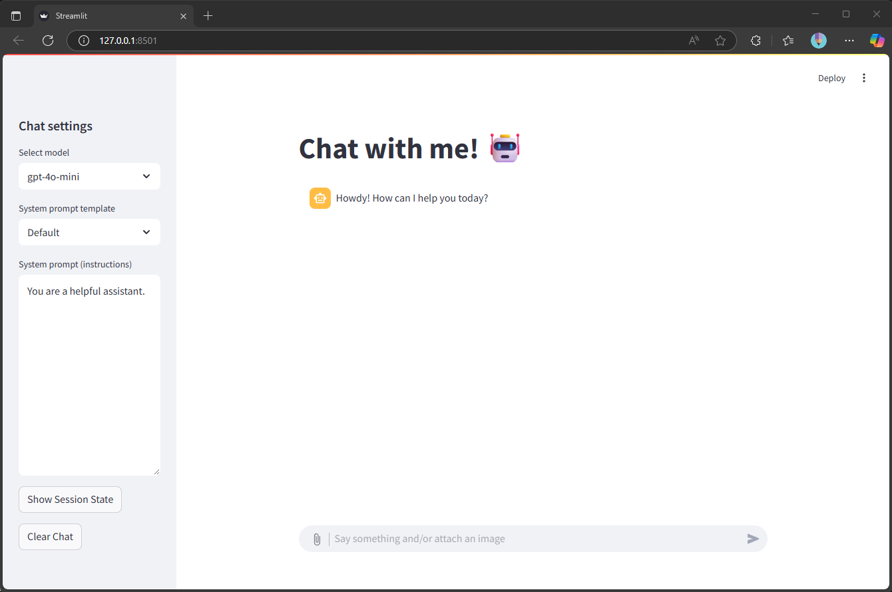

# Simple Azure AI Streamlit Chat Template

This project provides a simple Streamlit chat app to get you started with the Azure AI Foundry and Azure AI Inference client library for Python.



## 📝 Overview

### Features

- Supports both text and image inputs
- Seamlessly switch between preconfigured AI models via a dropdown menu
- Select from predefined system prompt templates or enter custom instructions
- Non-persistent chat history managed with Streamlit session state, including options to view or clear the session
- Easily clear the chat history at any time
- Print messages and session state to console for troubleshooting

### Azure AI Inference client library

This project is using the Azure AI Inference client library for Python (`azure-ai-inference`). If preferred, you can modify the code to use the [OpenAI Python client library](https://learn.microsoft.com/en-us/azure/ai-services/openai/supported-languages?tabs=dotnet-secure%2Csecure%2Cpython-secure%2Ccommand&pivots=programming-language-python) (`openai`) instead.

For a list of supported models, services, and known issues, refer to the [Azure AI Inference client library for Python documentation](https://learn.microsoft.com/en-gb/python/api/overview/azure/ai-inference-readme?view=azure-python-preview).

## 🚀 Quick Start

Use GitHub Codespaces, Dev Containers in VS Code, or setup manually:

1. **Clone the repository:**

  ```bash
  git clone https://github.com/gerbermarco/simple-azure-ai-streamlit-chat.git
  cd simple-azure-ai-streamlit-chat
  ```

2. **Copy and modify the `.env` file:**

  ```bash
  cp .env.example .env
  # Edit .env and update the values with your details
  ```

  > **Note:** Never commit your `.env` file to version control, as it contains sensitive information.

3. **Install dependencies:**

  ```bash
  pip install -r requirements.txt
  ```

4. **Run the Streamlit app:**

  ```bash
  streamlit run app.py
  ```
